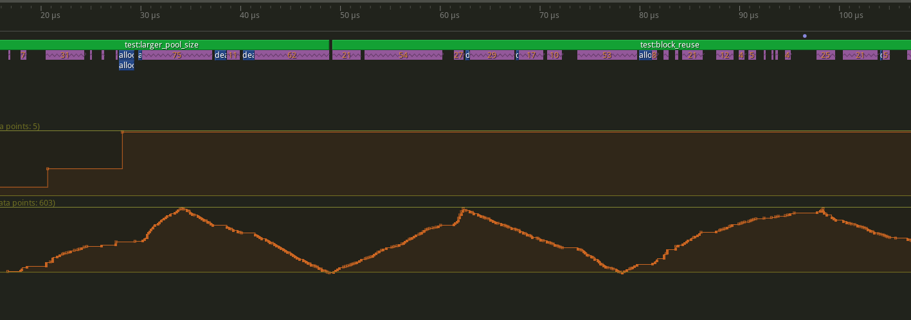

# Pool Allocator for C++

I'm a total amateur, just poking around at things I have no business playing with. Don't take anything
here as fact, this is purely an exploration of something I've never tried before.

This started as an implementation of the Pool Allocator by [Dmitry Soshnikov](http://dmitrysoshnikov.com/compilers/writing-a-pool-allocator/). I have 
used it as a base to test ideas, it is not suitable for production use.

## Features

* Compiles under C++98 or higher
* Simple usage, see [Object](src/Object.hpp) and [tests](tests.cpp)
* Lazy bump-allocator
* Tracks blocks for later free'ing
* Ensures efficient reuse of blocks
* Profiler instrumentation with [Tracy](https://github.com/wolfpld/tracy)
* Exponential block size increase

## Building

Simple dependencies:

* CMake
* GCC/Clang/MSVC
* Git

Run CMake configuration. Available presets are: 

 * `linux-debug`
 * `linux-debug-profile`
 * `linux-release`
 * `linux-release-profile`

`$ cmake --preset=<preset>`

Then build

`$ cmake --build --preset=<preset>`

## Operation

A class can have a static pool allocator which will be used for all allocations. Initially this pool will
not allocate any space. Once the first object is created by overloading `operator new` and `operator
delete`, the first block will be allocated based on the object size and the number of chunks per block.

If the pool is initialised with no parameter, it will default to `128` chunks per block. Providing
a parameter will override this default. When all the space is allocated to objects, the pool will request
a new block that will be twice the size of the previous, growing exponentially.

## Thoughts

I have only a vague idea what I'm doing with this. I understand the need for cache and memory coherency,
but I do not know enough to understand if what I'm doing is correct - I am profiling with Tracy and running
`perf` to check cache hits/misses but I don't fully understand the results. 

With Tracy there are periods where the operations are clearly being interrupted but only for short periods, 
360ns vs 26ns for two "identical" operations in a loop. I'm assuming this uneven timing is due to a busy
system with context switching etc that is interrupting my program. If I add some longer operation in the loops
such as printing to std::cout, it smooths out and the timing looks a lot more regular.



I'm going on the theory that the periods of time in question are just a fact of running on a non-realtime
system. Presumably if I pinned this process to an idle core it might perform better. I also ran `perf` which
I think tells me the total misses from all caches? The result isn't awful, but I had expected better (with 
zero knowledge to back that up).

```shell
build/release$ perf stat -B -e cache-references:u,cache-misses:u,cycles,instructions,branches,faults ./pool_allocator                                                                                      391ms  Tue 13 Feb 2024 19:49:03 GMT
 Performance counter stats for './pool_allocator':

            58,888      cache-references:u                                                    
            12,792      cache-misses:u                   #   21.72% of all cache refs         
         4,947,221      cycles                                                                
         4,488,682      instructions                     #    0.91  insn per cycle            
           902,910      branches                                                              
               161      faults                                                                

       0.001212164 seconds time elapsed

       0.001258000 seconds user
       0.000000000 seconds sys
```

I'm a long way past premature optimisation and I will not proceed any further in terms of optimisation.
I plan to polish the project and perform some more benchmarking vs other solutions.

### Native Optimisations

While tidying up the project to put it to bed I realised I wasn't compiling with native CPU optimisations. While I only
have a surface knowledge of this, I decided to enable and run the tests again. A lot of the uneven timings look a lot
smoother and overall runtime is reduced massively in all cases. The largest interruptions I'm seeing now are on the
of 1.5us, which seems reasonable (again no knowledge to back this up).


Perf stats didn't change in any notable way, cache miss percentages are within variation.